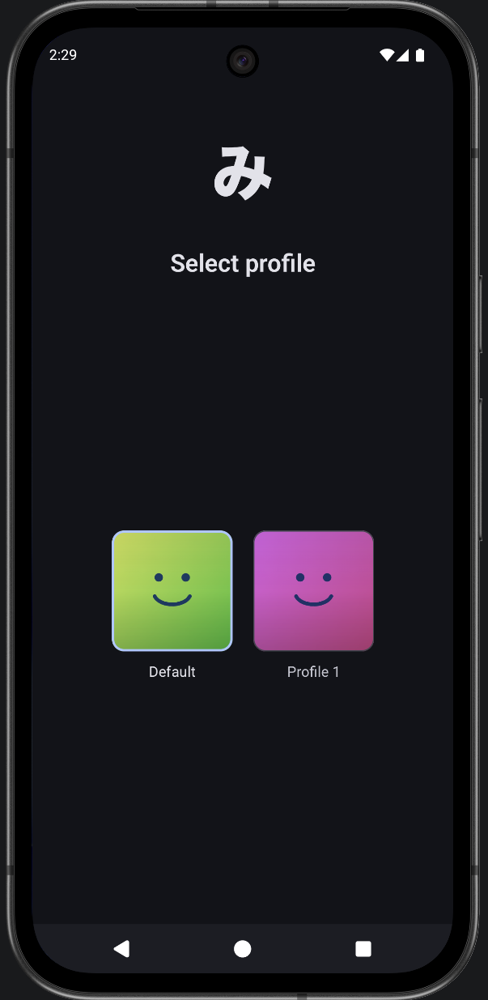
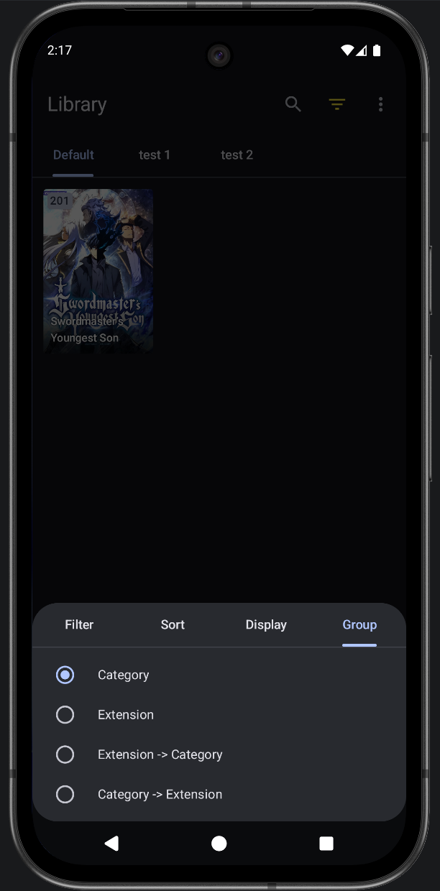

## Changes are made based on personal preferences and are not intended to be distributed for a wide-range audience

## Changes made

- Settings → Custom settings → Enable extensions auto-update
- Settings → Custom settings → Home screen tabs (order, visibility, startup)
- Settings → Custom settings → Duplicate detection
- Settings → Custom settings → User profiles
- Settings → Custom settings → Browse and Feeds long press
- Settings → Custom settings → Enable auto-scroll
- Library → Settings → Group
- Browse → Feeds
- Manga merge
- Manga preview

<table>
  <tr>
    <td align="center">
      
       <b>User Profiles</b>
    </td>
    <td align="center">
      
       <b>Library Group</b>
    </td>
  </tr>
  <tr>
    <td align="center">
      
       <b>Manga Merge</b>
    </td>
    <td align="center">
      
       <b>Manga Preview</b>
    </td>
  </tr>
</table>

### Disclaimer

The developer(s) of this application does not have any affiliation with the content providers available, and this application hosts zero content.

### License

<pre>
Copyright © 2015 Javier Tomás
Copyright © 2024 Mihon Open Source Project

Licensed under the Apache License, Version 2.0 (the "License");
you may not use this file except in compliance with the License.
You may obtain a copy of the License at

http://www.apache.org/licenses/LICENSE-2.0

Unless required by applicable law or agreed to in writing, software
distributed under the License is distributed on an "AS IS" BASIS,
WITHOUT WARRANTIES OR CONDITIONS OF ANY KIND, either express or implied.
See the License for the specific language governing permissions and
limitations under the License.
</pre>
